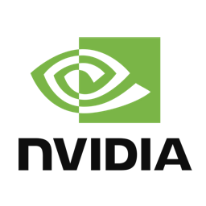

An ensemble of tools and libraries for generating infinite amounts of synthetic data for AI models and providing highly realistic environments for intelligent agents to acquire experience.

## Epic MegaGrants Recipient

Simbotic has been catapulted by Epic MegaGrants into serious development. Stay with us while we flesh out the code, documentation and tutorials. Contact us if you want to explore integrating Unreal Engine into robotics, simulation pipelines, intelligent video analytics, or any other computer vision project.     

## Technology Stack

Simbotic is heavily influeced by the following technology stack:

